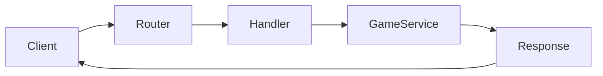

# Phase 0 — HTTP/API Foundation

## Goal

Build the smallest useful League Tokens HTTP API on top of the patterns learned in *Let's Go Further*.

The objective is not architectural sophistication. It is to become comfortable taking an HTTP request, validating it, calling application logic, and returning a predictable response.

## New concept

### Keep HTTP at the edge

An HTTP handler should mainly translate between HTTP and your application.

```text
HTTP request
    |
    v
handler
    |
    v
application operation
    |
    v
HTTP response
```

The handler should not know how a ride is persisted or how game rules work. At this stage, the "application operation" can be a very small service object or function. Do not create a full application/domain/adapter hierarchy yet.

This builds directly on *Let's Go Further*: routing, decoding JSON, validation, error handling, and response helpers are still the important skills.

## What you already know from Let's Go Further

- `net/http`
- routing
- handlers
- JSON encoding/decoding
- validation
- structured logging with `slog`
- application startup/shutdown
- configuration

## What changes in this project

Instead of CRUD movies, the API begins exposing the game vocabulary.

Start with read/write endpoints for:

- teams
- seasons
- matches
- players

Do not implement the ride rules yet.

## Suggested endpoints

```http
GET  /v1/teams
GET  /v1/seasons/{seasonID}
GET  /v1/seasons/{seasonID}/rounds
GET  /v1/matches/{matchID}
POST /v1/seasons/{seasonID}/players
GET  /v1/players/{playerID}
```

A registration request might look like:

```json
{
  "favourite_team_id": "real-madrid"
}
```

## Suggested project structure

```text
league-tokens/
├── cmd/
│   └── server/
│       └── main.go
├── internal/
│   ├── game/
│   │   └── service.go
│   └── http/
│       ├── router.go
│       ├── handlers.go
│       └── response.go
└── go.mod
```

Keep it intentionally small.

## Example

```go
func (app *application) registerPlayerHandler(w http.ResponseWriter, r *http.Request) {
    var input struct {
        FavouriteTeamID string `json:"favourite_team_id"`
    }

    if err := readJSON(w, r, &input); err != nil {
        writeError(w, http.StatusBadRequest, err)
        return
    }

    player, err := app.game.RegisterPlayer(r.Context(), input.FavouriteTeamID)
    if err != nil {
        writeError(w, http.StatusUnprocessableEntity, err)
        return
    }

    writeJSON(w, http.StatusCreated, player)
}
```

The handler is deliberately boring. That is a feature.

## Orientation graph



## Tasks

1. Create the Go module and `cmd/server/main.go`.
2. Add routing.
3. Add JSON request/response helpers.
4. Add teams, seasons, matches, and players as in-memory data first.
5. Add validation.
6. Add structured errors.
7. Add graceful shutdown.
8. Add handler tests.

## Research topics

Research only as you encounter them:

- HTTP handler vs service responsibilities
- request validation
- Go error wrapping
- `httptest`
- graceful shutdown

## Do not build yet

- repositories
- interfaces for every dependency
- dependency injection container
- domain events
- authentication
- PostgreSQL transaction orchestration
- market

## Done when

You can start the server, create a player, list teams, inspect matches, and return consistent JSON errors.

## What this prepares you for

The next phase replaces the in-memory state with PostgreSQL while keeping the HTTP layer largely unchanged.
