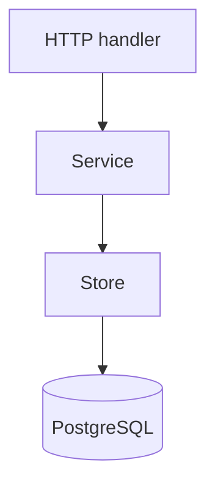

# Phase 1 — PostgreSQL Persistence

## Goal

Move the Phase 0 state into PostgreSQL while keeping the API behavior stable.

The main learning objective is to understand where SQL belongs and how to work with real relational data without hiding PostgreSQL behind layers of abstractions.

## New concept

### Persistence boundary

The application should know what it needs from storage, but not every HTTP handler should contain raw SQL.

Start with a small storage component instead of a generic repository framework.

```text
handler
   |
   v
service
   |
   v
Postgres store
   |
   v
PostgreSQL
```

You are learning a simple boundary first. Later, when modules appear, you can refine it.

## Data to persist

Begin with:

```text
teams
seasons
rounds
matches
players
```

Do not persist rides yet.

## Minimal schema sketch

```sql
CREATE TABLE teams (
    id text PRIMARY KEY,
    name text NOT NULL
);

CREATE TABLE players (
    id bigint GENERATED ALWAYS AS IDENTITY PRIMARY KEY,
    favourite_team_id text NOT NULL REFERENCES teams(id),
    created_at timestamptz NOT NULL DEFAULT now()
);

CREATE TABLE seasons (
    id bigint GENERATED ALWAYS AS IDENTITY PRIMARY KEY,
    state text NOT NULL,
    created_at timestamptz NOT NULL DEFAULT now()
);
```

## Example Go store

```go
type PlayerStore struct {
    db *sql.DB
}

func (s *PlayerStore) Create(ctx context.Context, teamID string) (Player, error) {
    const query = `
        INSERT INTO players (favourite_team_id)
        VALUES ($1)
        RETURNING id, favourite_team_id, created_at`

    var p Player
    err := s.db.QueryRowContext(ctx, query, teamID).
        Scan(&p.ID, &p.FavouriteTeamID, &p.CreatedAt)
    if err != nil {
        return Player{}, err
    }

    return p, nil
}
```

This is intentionally close to the SQL style you are learning in *Let's Go Further*.

## Migration workflow

```text
Go code
  |
  +---- SQL migrations ----> PostgreSQL
  |
  +---- queries -----------> PostgreSQL
```

Use migrations from the beginning. Keep schema changes explicit and reviewable.

## Tasks

1. Add PostgreSQL locally.
2. Create migrations.
3. Add the database connection and ping.
4. Replace in-memory teams with PostgreSQL.
5. Replace players with PostgreSQL.
6. Persist seasons, rounds, and matches.
7. Add integration tests against a real database.
8. Add useful indexes only when queries justify them.

## Research topics

- `database/sql` vs pgx
- transactions in `database/sql`
- PostgreSQL constraints
- indexes
- migrations
- integration testing with PostgreSQL

## Do not build yet

- ORM
- repository interfaces everywhere
- sqlc per module
- schema-per-context
- event tables
- double-entry ledger

## Orientation graph



## Done when

A fresh machine can run migrations, start PostgreSQL, start the Go server, and use the API without any in-memory game state.

## What this prepares you for

Now you have enough persistence knowledge to model the actual ride domain rather than trying to learn domain modeling and SQL at the same time.
