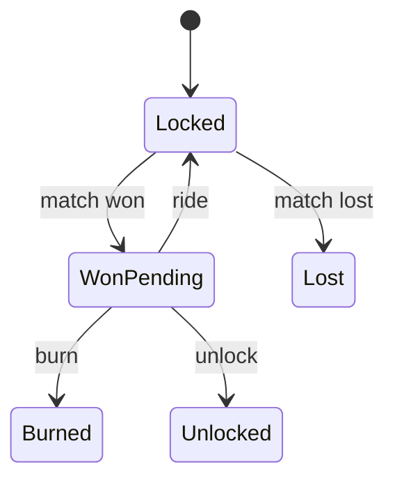

# Phase 2 — Domain Model and State Machines

## Goal

Turn the game rules into explicit Go types and state transitions.

This is the first phase where the project becomes a true domain problem rather than an API around tables.

## New concept

### Domain invariants

An invariant is a rule that must always be true.

For rides, the game engine specification gives you a natural state machine:

```text
Locked
  |
  +-- win --> WonPending
  |             |
  |             +-- Ride --> Locked
  |             +-- Burn --> Burned
  |             +-- Unlock -> Unlocked
  |
  +-- loss --> Lost
```

A `WonPending` ride can branch into three player choices. A terminal state cannot be modified.

The goal is to make invalid states difficult or impossible to create through normal domain operations.

## Example type

```go
type RideState string

const (
    RideLocked     RideState = "locked"
    RideWonPending RideState = "won_pending"
    RideLost       RideState = "lost"
    RideBurned     RideState = "burned"
    RideUnlocked   RideState = "unlocked"
)

type Ride struct {
    ID           string
    PlayerID     int64
    TeamID       string
    MatchID      string
    State        RideState
    TokensLocked Decimal
    BaseAtLock   Decimal
    Acc          Decimal
    Streak       int
}
```

## Example domain method

```go
func (r *Ride) Burn() error {
    if r.State != RideWonPending {
        return ErrInvalidRideState
    }

    r.State = RideBurned
    return nil
}
```

The important idea is not the exact code. It is that the business rule has a home.

## Separate behavior from persistence

```text
Postgres row
      |
      v
   Ride value
      |
      v
 domain operation
      |
      v
 new state
```

Avoid putting all the rules directly into SQL just because the data lives in PostgreSQL.

## State transition tests

Write tests before expanding the system.

```go
func TestRide_BurnRequiresWonPending(t *testing.T) {
    ride := Ride{State: RideLocked}

    err := ride.Burn()

    if !errors.Is(err, ErrInvalidRideState) {
        t.Fatalf("expected invalid state error, got %v", err)
    }
}
```

Then cover:

- lock
- win
- loss
- ride continuation
- burn
- unlock
- terminal-state protection

## Tasks

1. Introduce domain types.
2. Model the ride state machine.
3. Model Season and Round state.
4. Add value objects or helper types only where they remove ambiguity.
5. Implement domain operations without SQL.
6. Write focused unit tests.
7. Adapt the API layer to call these domain operations.

## Research topics

- state machines
- domain invariants
- entities vs value objects
- aggregate roots
- domain errors

Do not try to implement DDD terminology just for the sake of it. Research the concept, then decide whether it clarifies this project.

## Do not build yet

- domain events
- repositories with many interfaces
- CQRS
- event sourcing
- full Clean Architecture

## Orientation graph



## Done when

You can test the complete ride state machine without a database or HTTP server.

## What this prepares you for

The next phase combines these domain transitions with database changes that must happen atomically.
