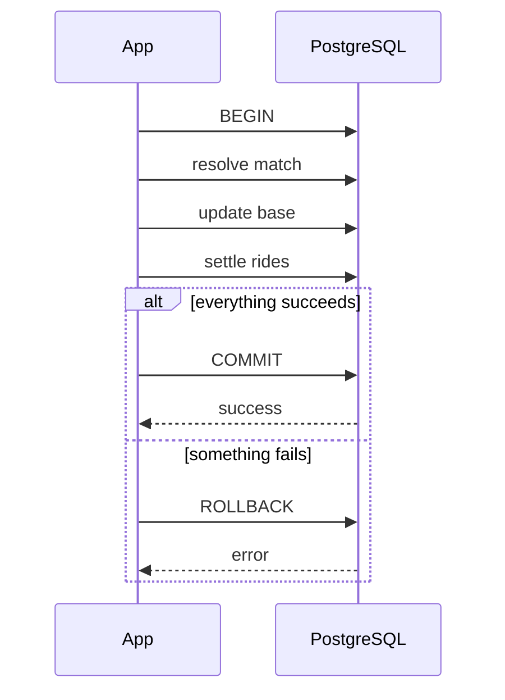

# Phase 3 — Transactions and Atomic Operations

## Goal

Make important game operations all-or-nothing.

The first major operation is `ResolveMatch`, because it changes several pieces of state together.

## New concept

### Transaction boundary

A database transaction defines a group of changes that must either all succeed or all be rolled back.

For example:

```text
ResolveMatch
   |
   +-- mark match resolved
   +-- update team base
   +-- resolve rides
   +-- update token balances
   +-- update TB
   +-- COMMIT
```

If a later step fails, the earlier changes must not remain committed.

## Why this matters here

The game engine specification says one match result can affect many rides and related balances. Treating those updates independently would create impossible intermediate states.

## Example transaction

```go
func (s *Store) ResolveMatch(ctx context.Context, matchID string) error {
    tx, err := s.db.BeginTx(ctx, nil)
    if err != nil {
        return err
    }
    defer tx.Rollback()

    if err := resolveMatchRow(ctx, tx, matchID); err != nil {
        return err
    }

    if err := updateTeamBase(ctx, tx, matchID); err != nil {
        return err
    }

    if err := settleRides(ctx, tx, matchID); err != nil {
        return err
    }

    if err := tx.Commit(); err != nil {
        return err
    }

    return nil
}
```

The example is intentionally straightforward. Learn the transaction before trying to abstract it.

## Transaction diagram



## First transactional operations

Implement:

### `Register`

```text
player created
+ starting currency
+ season registration
```

### `BuyFromReserve`

```text
currency - price
reserve - tokens
wallet + tokens
```

### `Lock`

```text
wallet tokens - locked amount
ride created
```

### `ResolveMatch`

```text
match resolved
+ base updated
+ rides resolved
```

### `Burn`

```text
ride burned
+ TB awarded
+ currency returned
+ tokens destroyed
```

## Tasks

1. Learn `sql.Tx`.
2. Pick transaction boundaries based on business operations, not table boundaries.
3. Move multi-step operations into transactions.
4. Add rollback tests.
5. Add tests that prove partial writes do not survive an error.

## Research topics

- ACID transactions
- transaction isolation
- commit vs rollback
- PostgreSQL row locks
- deadlocks
- transaction scope

## Do not build yet

- distributed transactions
- message queues
- outbox pattern
- event sourcing
- separate database per module

## Done when

A failure injected halfway through any major operation leaves the database exactly as it was before the operation started.

## What this prepares you for

Once operations are atomic, the next question is: what happens when two requests try to perform the same operation at the same time?
