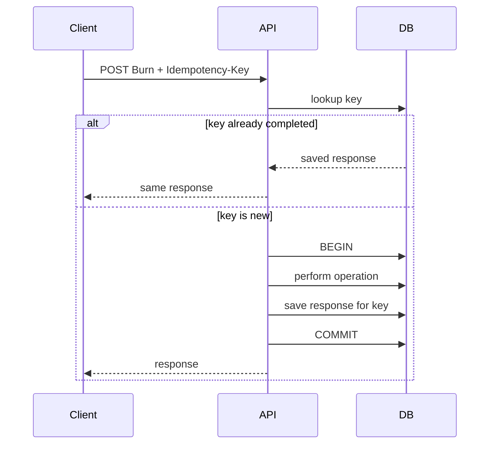

# Phase 4 — Concurrency and Idempotency

## Goal

Make the system correct when requests race, retries happen, or the same external result arrives twice.

## New concept

### Concurrency correctness

A backend must remain correct even when two operations overlap.

For example:

```text
Request A -----> Burn ride
Request B -----> Burn same ride
```

Both may read `WonPending` before either writes `Burned`.

The database must guarantee that only one succeeds.

## First technique: row locking

For operations that need exclusive access to a row:

```sql
SELECT id, state, version
FROM rides
WHERE id = $1
FOR UPDATE;
```

Then perform the state transition inside the same transaction.

```text
BEGIN
  SELECT ride FOR UPDATE
  validate state
  update ride
COMMIT
```

## Second technique: optimistic concurrency

You can also use a version column:

```sql
UPDATE rides
SET state = 'burned',
    version = version + 1
WHERE id = $1
  AND version = $2
  AND state = 'won_pending';
```

If the affected-row count is zero, another transaction won the race or the state was already invalid.

Start with one technique. Compare them after you understand both.

## Idempotency

Some operations may be retried.

`ResolveMatch` is an especially good example: an upstream system may deliver the same result twice.

Your desired property is:

```text
ResolveMatch(match 42)
ResolveMatch(match 42)

result = exactly the same final state
```

A simple first solution is a guarded update:

```sql
UPDATE matches
SET status = 'resolved'
WHERE id = $1
  AND status <> 'resolved';
```

Then check `RowsAffected`.

Later, for HTTP commands, add an idempotency key table.

## Idempotency flow



## Tasks

1. Create a test that sends two concurrent burn attempts.
2. Make exactly one succeed.
3. Add optimistic concurrency or `FOR UPDATE` where appropriate.
4. Make `ResolveMatch` idempotent.
5. Add idempotency keys to one mutating HTTP endpoint.
6. Test retry behavior.

## Research topics

- race conditions
- `SELECT ... FOR UPDATE`
- optimistic locking
- unique constraints as concurrency tools
- idempotency keys
- at-least-once delivery

## Do not build yet

- distributed locks
- Redis locks
- Kafka delivery guarantees
- exactly-once processing claims
- multi-node schedulers

## Done when

Your tests demonstrate that concurrent or repeated operations cannot duplicate a burn, duplicate a result settlement, or create negative balances.

## What this prepares you for

You now have enough complexity to start seeing natural module boundaries. The next phase extracts those boundaries without introducing a giant architecture framework.
