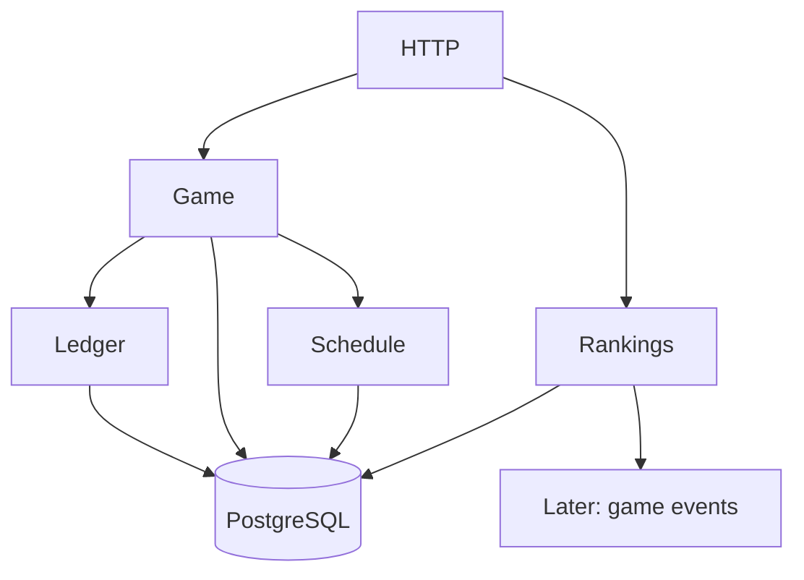

# Phase 5 — Modular Monolith Boundaries

## Goal

Organize the growing application into a few business modules without turning each module into a miniature enterprise architecture project.

## New concept

### Module ownership

A module should own a coherent set of state and rules.

For this project, a useful first split is:

```text
internal/
    game/
    ledger/
    schedule/
    rankings/
    http/
```

A module should be able to answer:

> What state do I own, and what rules am I responsible for protecting?

## Suggested ownership

### game

Owns:

- seasons
- rounds
- rides
- `acc`
- base price
- game state transitions

### ledger

Owns:

- currency balances
- token balances
- reserve balances

### schedule

Owns:

- teams
- rounds/matches as external schedule data
- match results from the feed

### rankings

Owns:

- player TB totals
- team baskets
- leaderboard projections

## Boundary rule

Start with a simple rule:

> A module owns its state. Other modules use its public operations instead of reaching into its tables directly.

```text
HTTP
 |
 +------> game ------> ledger
 |          |
 |          +------> schedule
 |
 +------> rankings
```

The important part is that `game` should not perform raw SQL against ledger tables.

## Why not a huge interface hierarchy?

At this stage, use concrete types where possible.

Introduce an interface when:

- a dependency needs replacement in a test, or
- a boundary needs to be explicit because one module consumes another.

For example:

```go
type Ledger interface {
    LockTokens(ctx context.Context, playerID int64, teamID string, amount Decimal) error
    Burn(ctx context.Context, playerID int64, teamID string, amount Decimal) error
}
```

You do not need `LedgerPort`, `LedgerAdapter`, `LedgerFactory`, and `LedgerProvider` unless a concrete problem appears.

## Composition root

Keep construction explicit in `main.go`:

```go
ledger := ledger.NewStore(db)
game := game.NewService(game.Dependencies{
    Ledger: ledger,
})

app := application{
    Game: game,
}
```

This is enough dependency injection for now.

## Suggested structure

```text
internal/
├── game/
│   ├── service.go
│   ├── ride.go
│   ├── season.go
│   └── repository.go
├── ledger/
│   ├── ledger.go
│   └── repository.go
├── schedule/
│   ├── schedule.go
│   └── repository.go
├── rankings/
│   └── rankings.go
└── http/
    ├── router.go
    └── handlers.go
```

If one package becomes too large, then split it further.

## Tasks

1. Move game rules under `game`.
2. Move balance operations under `ledger`.
3. Move external match data under `schedule`.
4. Move leaderboard calculations under `rankings`.
5. Remove cross-module direct table access.
6. Introduce the smallest necessary interfaces.
7. Keep composition in `main.go`.
8. Write package-level tests.

## Research topics

- modular monolith
- coupling vs cohesion
- dependency direction
- ports and adapters (at a conceptual level)
- composition root
- package-level APIs in Go

## Do not build yet

- microservices
- service discovery
- gRPC
- network RPC
- Kafka/NATS
- separate deployment units
- generic `shared`/`common` packages full of helpers

## Orientation graph



## Done when

You can explain each module's ownership in one sentence, and no module needs to know another module's table layout.

## What this prepares you for

The next phase focuses deeply on the ledger because the game's balance rules justify stronger consistency boundaries than the rest of the system.
