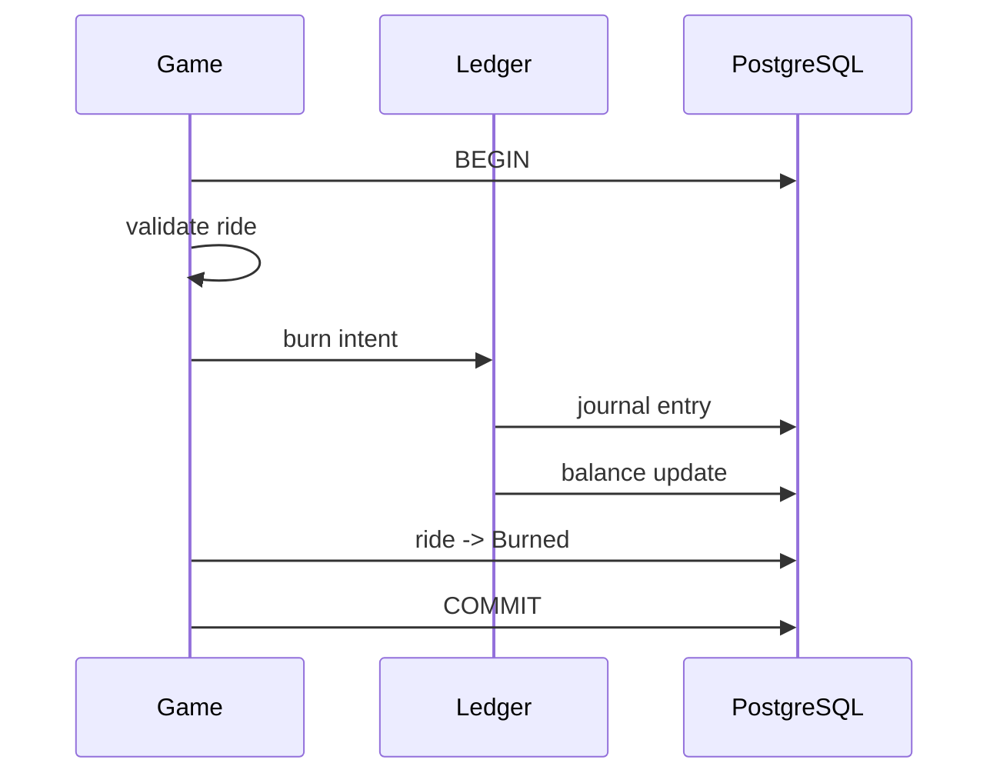

# Phase 6 — Ledger and Accounting Authority

## Goal

Create a single place responsible for currency and token movement.

This is the first phase where a more specialized internal subsystem is justified by a strong domain invariant.

## New concept

### One authority for balances

If several modules can directly change balances, it becomes difficult to answer a critical question:

> Where is the rule that guarantees balances cannot be corrupted?

Instead:

```text
          Game
           |
           | intent
           v
        Ledger
        /    \
       v      v
   journal  balances
```

The ledger owns balance mutation. Other modules request operations.

## Start simple

You do not need a full accounting product.

Use:

```text
accounts
journal_entries
balances
```

An account could represent:

- player currency
- player tokens for a team
- team reserve
- common pool

## Double-entry idea

A movement has two sides.

Example: buying tokens.

```text
Player currency      -10
Common pool           +10
Player tokens         +10
Team reserve          -10
```

You can model the journal as pairs of entries that describe the movement.

## Example API

```go
type Ledger struct {
    db *sql.DB
}

func (l *Ledger) TransferCurrency(
    ctx context.Context,
    tx *sql.Tx,
    playerID int64,
    amount Decimal,
) error {
    // validate balance
    // append journal entries
    // update balance projection
    return nil
}
```

The exact shape should evolve with your database model.

## Important rule

The game should never do this:

```sql
UPDATE ledger.balances
SET balance = balance - $1
```

It should call something like:

```go
err := app.ledger.DeductCurrency(...)
```

This gives the ledger one place to enforce:

- no negative player balances
- journal consistency
- idempotency
- balance projection updates

## Transaction boundary

For now keep game + ledger in the same PostgreSQL transaction.



No asynchronous messaging is needed yet.

## Tasks

1. Introduce account identities.
2. Create journal entries.
3. Create balance projections.
4. Move all balance writes into the ledger.
5. Add database constraints for non-negative balances.
6. Make balance operations transactional.
7. Add concurrency tests.
8. Prove that game code cannot bypass the ledger in normal usage.

## Research topics

- double-entry bookkeeping
- accounting ledgers
- balance projection
- invariants at database level
- transaction consistency
- idempotent financial operations

## Do not build yet

- separate ledger service
- Kafka
- eventual consistency between game and ledger
- complex event sourcing
- general accounting abstractions unrelated to the game

## Done when

You can trace a buy, lock, loss, and burn operation from the API to the ledger journal and back to the player's visible balance.

## What this prepares you for

Once the core operation is correct, you can safely introduce work that happens outside the request lifecycle, such as automatic burns.
