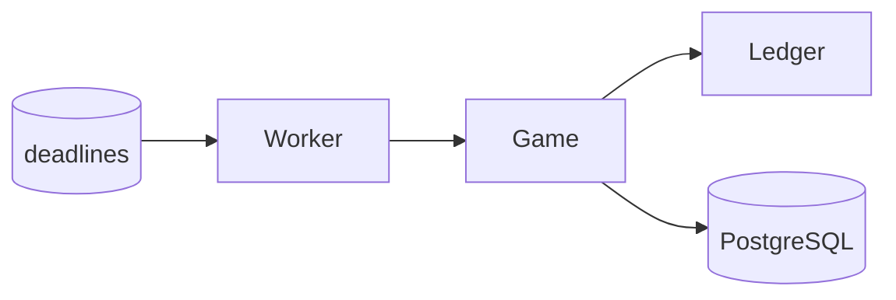

# Phase 7 — Background Workers

## Goal

Add system-driven operations such as automatic burn deadlines without turning the application into a distributed scheduling system.

## New concept

### Long-running process lifecycle

A background worker is just another part of your Go process.

```text
main
 |-------------------------|
 |                         |
HTTP server            worker goroutine
 |                         |
handlers                scheduler
 |                         |
application             game operation
 |                         |
 +----------- PostgreSQL -+
```

The important new lessons are:

- cancellation
- graceful shutdown
- avoiding duplicate work
- retry behavior

## Start with one worker

Use a simple ticker or timer abstraction first.

```go
func startAutoBurnWorker(
    ctx context.Context,
    game *game.Service,
    interval time.Duration,
) {
    ticker := time.NewTicker(interval)
    defer ticker.Stop()

    for {
        select {
        case <-ctx.Done():
            return
        case now := <-ticker.C:
            if err := game.ProcessDueAutoBurns(ctx, now); err != nil {
                slog.Error("auto burn failed", "error", err)
            }
        }
    }
}
```

This is intentionally simpler than the production scheduler described in the larger backend design.

## Worker safety

The worker itself should not be trusted to run exactly once.

Instead, make the operation safe to repeat:

```text
worker runs
    |
    +--> operation succeeds

worker restarts
    |
    +--> operation sees already-processed state
    +--> does nothing
```

This reuses your Phase 4 idempotency knowledge.

## Graceful shutdown

```go
ctx, stop := signal.NotifyContext(context.Background(), os.Interrupt, syscall.SIGTERM)
defer stop()

var wg sync.WaitGroup

wg.Add(1)
go func() {
    defer wg.Done()
    runWorker(ctx)
}()

serverErr := server.ListenAndServe()

stop()
wg.Wait()
```

Keep the lifecycle explicit.

## Tasks

1. Add a worker process inside the same Go binary.
2. Process due auto-burns.
3. Make the operation idempotent.
4. Handle worker errors without killing the process.
5. Add context cancellation.
6. Add graceful shutdown tests or focused lifecycle tests.
7. Add a simple persisted deadline if the in-memory schedule is insufficient.

## Research topics

- `context.Context`
- worker pools
- goroutine lifecycle
- graceful shutdown
- timers vs tickers
- retry/backoff
- persisted schedules

## Do not build yet

- distributed scheduler
- leader election
- Redis queues
- message broker
- Kubernetes CronJobs

## Orientation graph



## Done when

An expired ride can be automatically burned without a user request, and restarting the server does not cause duplicate rewards or corrupted state.

## What this prepares you for

Now you have a genuine reason for asynchronous side effects. The next phase introduces an outbox so those side effects can be delivered reliably after the main transaction commits.
