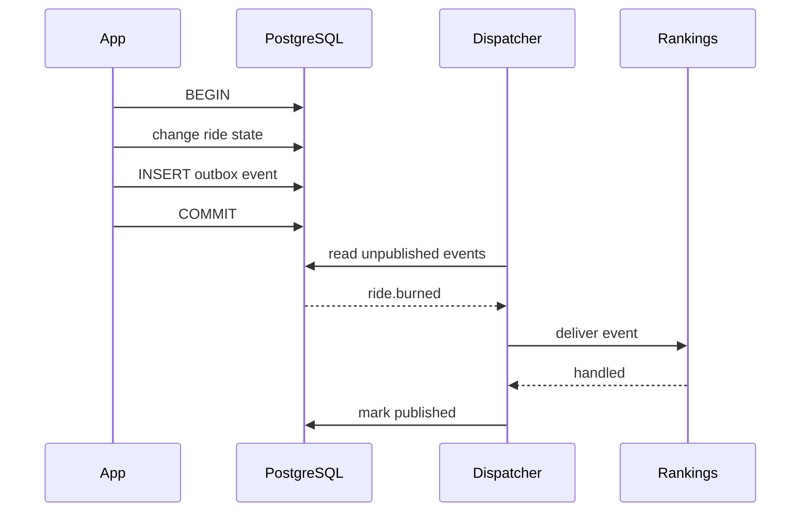

# Phase 8 — Transactional Outbox and Events

## Goal

Introduce events only where they solve a real problem: reacting to committed game changes without coupling the core operation directly to every downstream concern.

## New concept

### Transactional outbox

Suppose burning a ride should also update rankings and produce an audit record.

If you do this:

```text
commit ride
send ranking update
send audit update
```

a process crash can leave the systems out of sync.

Instead:

```text
BEGIN
  burn ride
  append outbox event
COMMIT

later:
  dispatcher reads outbox
  ranking consumer handles event
  audit consumer handles event
```

The important guarantee is:

> The state change and the fact that the event should be published are committed together.

## Minimal schema

```sql
CREATE TABLE outbox_events (
    id bigint GENERATED ALWAYS AS IDENTITY PRIMARY KEY,
    type text NOT NULL,
    aggregate_id text NOT NULL,
    payload jsonb NOT NULL,
    occurred_at timestamptz NOT NULL DEFAULT now(),
    published_at timestamptz
);
```

## Example transaction

```go
func burnRide(ctx context.Context, tx *sql.Tx, rideID string) error {
    // 1. update game state
    if err := burnRideState(ctx, tx, rideID); err != nil {
        return err
    }

    // 2. append event in the same transaction
    payload := []byte(`{"ride_id":"` + rideID + `"}`)
    if _, err := tx.ExecContext(ctx, `
        INSERT INTO outbox_events (type, aggregate_id, payload)
        VALUES ($1, $2, $3)`,
        "ride.burned", rideID, payload,
    ); err != nil {
        return err
    }

    return nil
}
```

Use parameterized SQL in the real implementation; the example is intentionally compact.

## Dispatcher

Start with one in-process dispatcher:

```text
PostgreSQL
    |
    v
 outbox table
    |
    v
 dispatcher
  /     \
 v       v
ranking audit
```

A consumer must be idempotent.

Do not claim "exactly once". Aim for:

> at-least-once delivery + idempotent consumers.

## First useful events

Keep the event vocabulary tiny:

```text
ride.burned
match.resolved
player.registered
```

You do not need an event for every method call.

## Ranking consumer example

```go
func (r *Rankings) HandleRideBurned(ctx context.Context, e RideBurned) error {
    // UPDATE ... total_tb = total_tb + e.TBCredit
    // Guard with event ID so retries are harmless.
    return nil
}
```

## Why this belongs at the end

You already know transactions, concurrency, idempotency, modules, and workers by this point.

The outbox becomes a small combination of concepts you already understand rather than a new architecture dropped on top of the project.

## Tasks

1. Add an outbox table.
2. Write events in the same transaction as game state changes.
3. Build one dispatcher.
4. Add the `ride.burned` event.
5. Move rankings updates to an event consumer.
6. Make the consumer idempotent.
7. Add restart/retry tests.

## Research topics

- transactional outbox pattern
- at-least-once delivery
- idempotent consumers
- event schemas
- event versioning
- eventual consistency

## Do not build yet

- Kafka/NATS
- distributed event streams
- event sourcing
- CQRS everywhere
- message ordering across services
- schema registry

## Orientation graph



## Done when

You can crash the process after a game transaction commits but before the ranking consumer runs, restart the application, and still process the event successfully.

## What this prepares you for

At the end of Phase 8 you have a real modular monolith with meaningful domain boundaries, strong transactions, concurrency safety, background processing, and reliable asynchronous side effects. The production architecture can now be studied as an evolution from this foundation rather than something you must imitate from day one.
